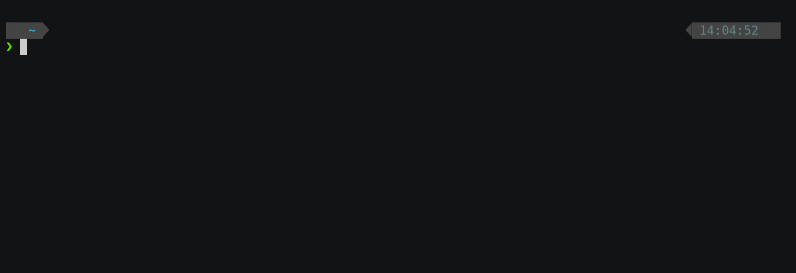

# Empathy Helm Charts

> Please avoid updating this README directly, as this file is automatically generated by templating [docs/README.tpl](docs/README.tpl) to keep the list of supported Helm Charts up to date, based on the content of the `charts` folder.
>
>If updating the README is required, please update that template file. It will be rendered as part of the workflow of the Pull Request, and pushed back to the branch of the same.

This repository is intended for sharing [Helm Charts](https://helm.sh/) maintained by [Empathyco](https://www.empathy.co/).

## TL;DR
```bash
$ helm repo add empathy-public https://empathyco.github.io/helm-charts
$ helm install --name my-release empathy-public/<chartName>
```


## Install Helm

Please refer to the official [Helm install guide](https://github.com/helm/helm#install) and ensure that the `helm` binary can be invoked from your `$PATH`. Using tools like [helmenv](https://github.com/little-angry-clouds/kubernetes-binaries-managers/tree/master/cmd/helmenv) can help you using multiple versions of Helm, depending on the version of the Chart you want to work with.

## Use this repo

Run the following command to add this repository to your Helm environment, so you can start downloading and installing charts from here:
```bash
$ helm repo add empathy-public https://empathyco.github.io/helm-charts
```

## Contributing
We are open to contributors, you can contribute to Empathy Helm Charts through code, documentation or bug reports. More information about contributing can be found [here](CONTRIBUTING.md).

Following the list complete list of supported Helm Charts:

* cerebro
* cost-report
* deadman-switch
* elasticsearch-umbrella
* imagepullsecret-patcher
* yace-exporter